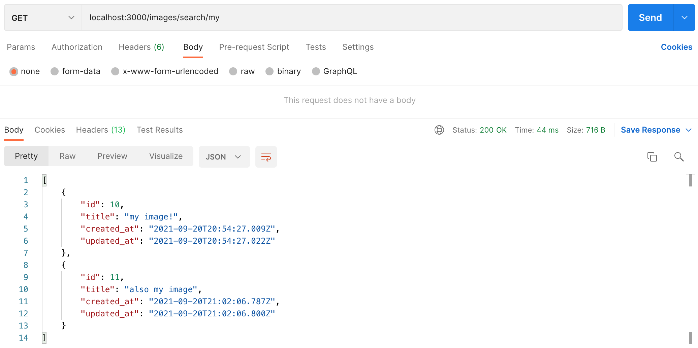

# img_repo

Upload, view, search, delete and resize your images!  
This project is a submission to the 2021 Winter internship application at Shopify.

## Features

- Add an image
- Delete an image
- Get an image
- Search images by title
- Get a resized image

## Setup

1. Download a copy of this repository, either via the [.zip download](https://github.com/nfgrep/img_repo/archive/refs/heads/main.zip) or `git clone`:

   ```
   git clone https://github.com/nfgrep/img_repo
   ```

2. Open a terminal and navigate to the root of the project:

   ```
   cd img_repo
   ```

3. Ensure you are using ruby version 3.0.2:

   ```
   ruby --version
   ```

4. Install image magick, either from the [official website](https://imagemagick.org/script/download.php) or with homebrew:

   ```
   brew install imagemagick
   ```

5. Install dependencies with bundler:

   ```
   bundle install
   ```

6. Migrate the db:

   ```
   rails db:migrate
   ```

7. Run the server:
   ```
   rails s
   ```

## Usage

### Upload an image

Send a `POST` to `/images/` with formdata containing a `file:file` and a `title:string` parameter:


### See what images exist

Send a `GET` to `/images/`:


### Get an image

Send a `GET` to `/images/:id` where `:id` is the id of your desired image:


### Search an image

Send a `GET` to `/images/search/:query` where `:query` is your search string:



### Get a resized image

Send a `GET` to `/images/:id/:size` where `:id` is the id of your desired image, and `:size` is the size:


### Delete an image

Send a `DELETE` to `/images/:id` where `:id` is the id of the image you'd like to delete:


